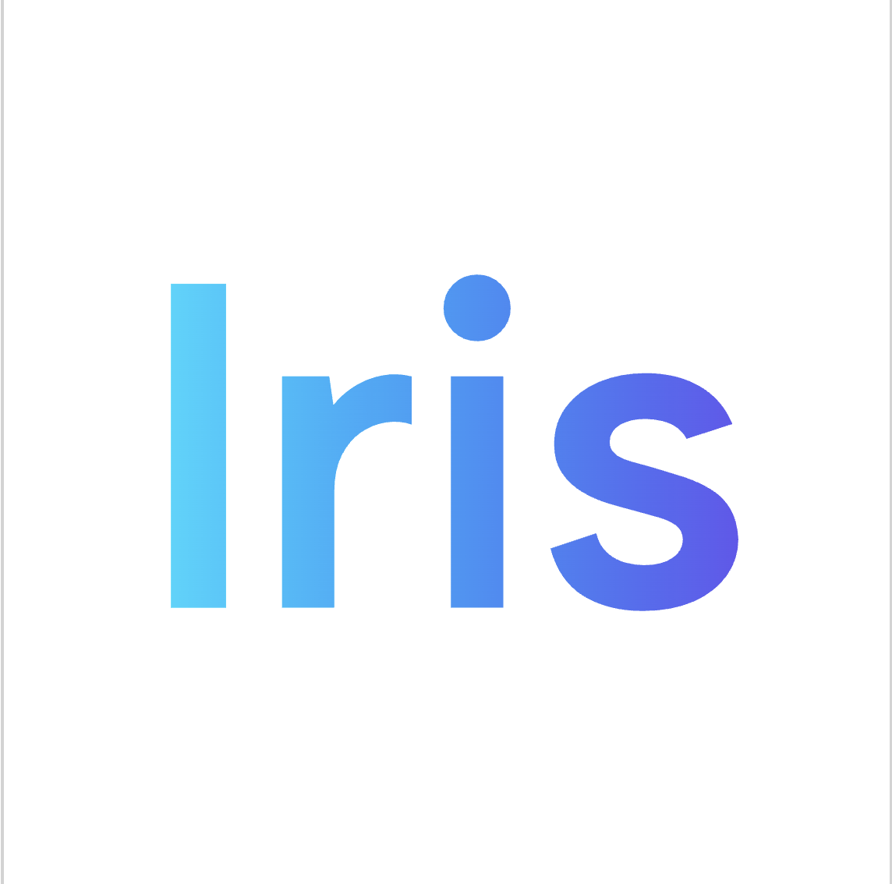
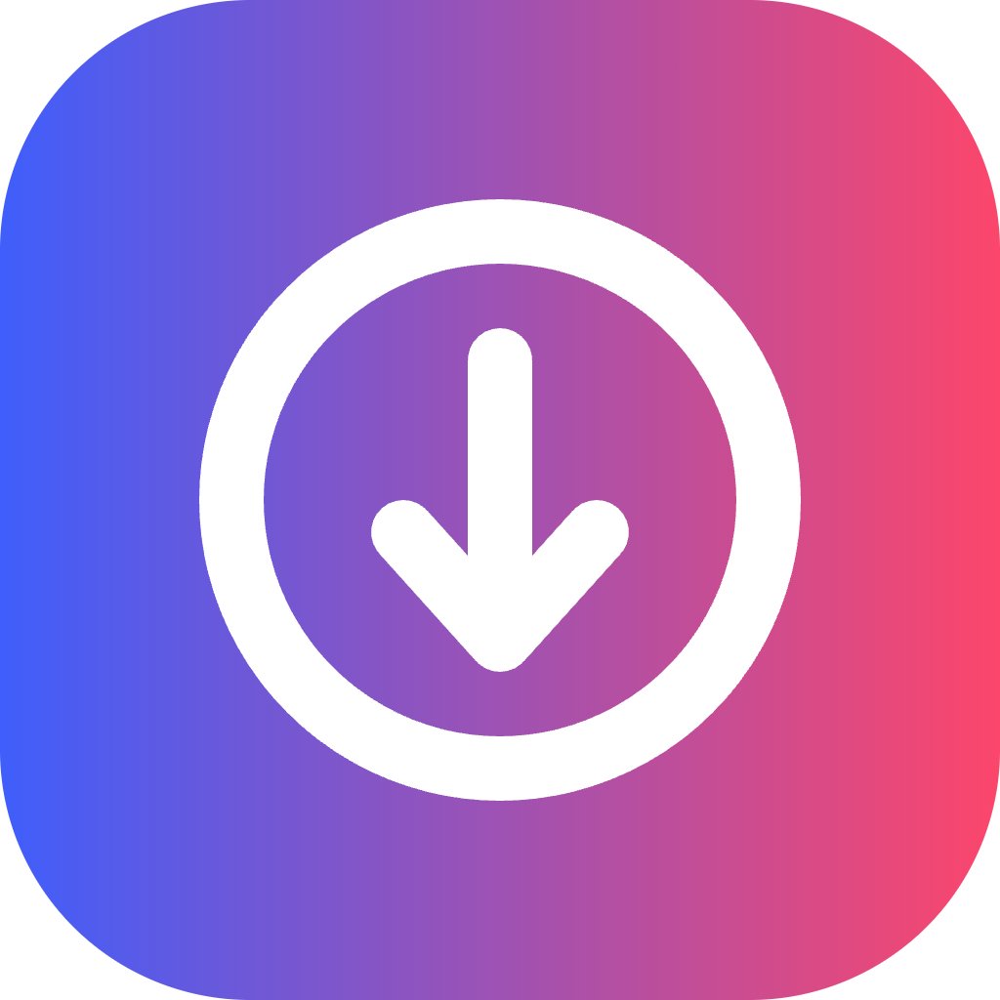
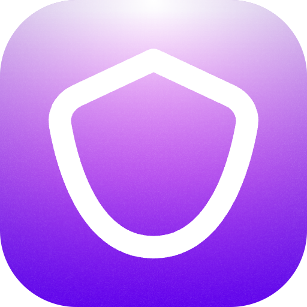
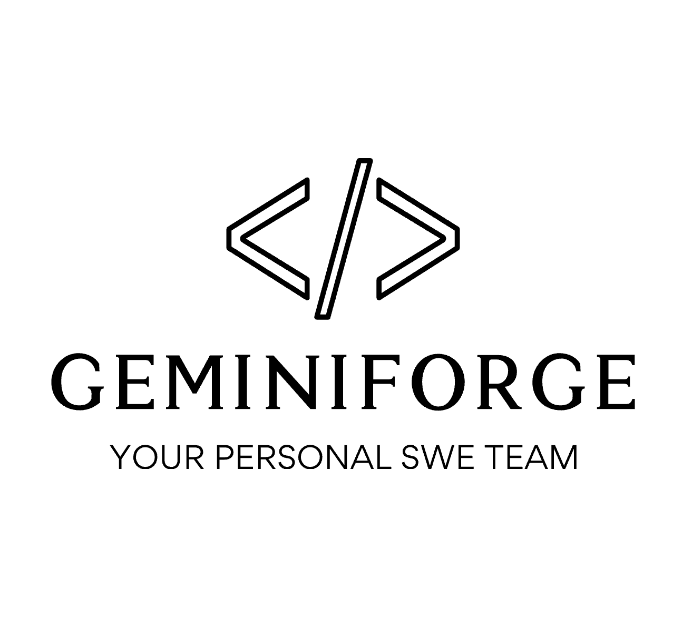
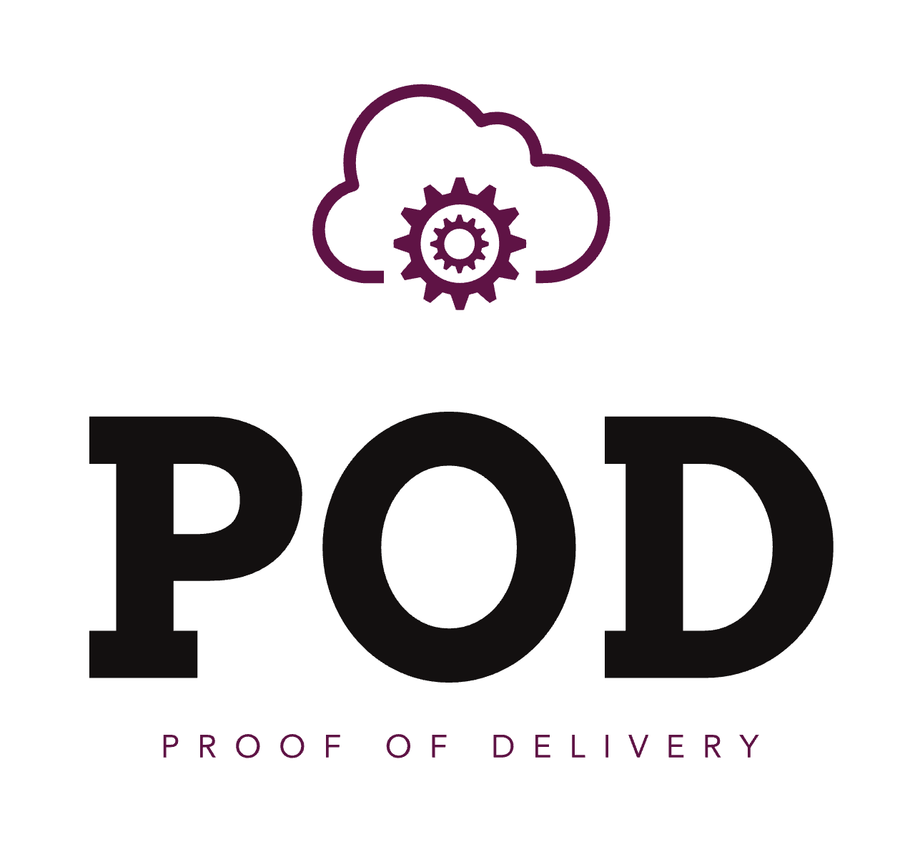
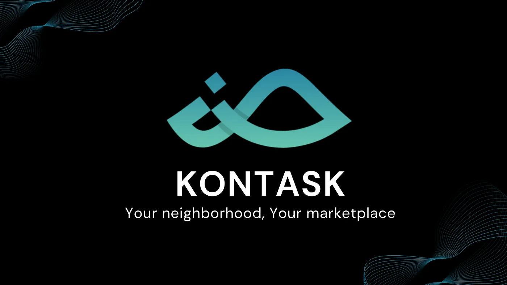

<h1 align="center">
    
</h1>

# 💫 About Me:
 CS and Math majors at DePauw University 🌍 I'm based in Indiana, USA 🤝 I'm open to collaborating on intersting projects 
# What I have done recently:

 |  | 
:---:|:---:|:---:
**Android Frontier LLM** | **InstaSave** | **Phish Triage** |

 |  | 
:---:|:---:|:---:
**GeminiForge** | **POD microservice** | **LLM-based InterviewPrep**

 | 
:---:|:---:
**Kontask** | **AI MusicFinder**

<!-- What I have done recently -->

<table>
  <tr>
    <td align="center">
       
      <b>Android Frontier LLM</b>
    </td>
    <td align="center">
       
      <b>InstaSave</b>
    </td>
    <td align="center">
       
      <b>Phish Triage</b>
    </td>
  </tr>
  <tr>
    <td align="center">
       
      <b>GeminiForge</b>
    </td>
    <td align="center">
       
      <b>POD microservice</b>
    </td>
    <td align="center">
       
      <b>LLM-based InterviewPrep</b>
    </td>
  </tr>
  <tr>
    <td align="center">
       
      <b>Kontask</b>
    </td>
    <td align="center">
       
      <b>AI MusicFinder</b>
    </td>
    <td></td> <!-- empty to keep the 3-column grid aligned -->
  </tr>
</table>

 |  | 
:---:|:---:|:---:
**Android Frontier LLM** | **InstaSave** | **Phish Triage**

 |  | 
:---:|:---:|:---:
**GeminiForge** | **POD microservice** | **LLM-based InterviewPrep**

 | 
:---:|:---:
**Kontask** | **AI MusicFinder**

<!-- What I have done recently (all images 512x512) -->

<table>
  <tr>
    <td align="center">
       
      <b>Android Frontier LLM</b>
    </td>
    <td align="center">
       
      <b>InstaSave</b>
    </td>
    <td align="center">
       
      <b>Phish Triage</b>
    </td>
  </tr>
  <tr>
    <td align="center">
       
      <b>GeminiForge</b>
    </td>
    <td align="center">
       
      <b>POD microservice</b>
    </td>
    <td align="center">
       
      <b>LLM-based InterviewPrep</b>
    </td>
  </tr>
  <tr>
    <td align="center">
       
      <b>Kontask</b>
    </td>
    <td align="center">
       
      <b>AI MusicFinder</b>
    </td>
    <td></td>
  </tr>
</table>

<!-- What I have done recently (all images 160x160) -->

<table>
  <tr>
    <td align="center">
       
      <b>Android Frontier LLM</b>
    </td>
    <td align="center">
       
      <b>InstaSave</b>
    </td>
    <td align="center">
       
      <b>Phish Triage</b>
    </td>
  </tr>
  <tr>
    <td align="center">
       
      <b>GeminiForge</b>
    </td>
    <td align="center">
       
      <b>POD microservice</b>
    </td>
    <td align="center">
       
      <b>LLM-based InterviewPrep</b>
    </td>
  </tr>
  <tr>
    <td align="center">
       
      <b>Kontask</b>
    </td>
    <td align="center">
       
      <b>AI MusicFinder</b>
    </td>
    <td></td>
  </tr>
</table>

 |  | 
:---:|:---:|:---:
**Android Frontier LLM** | **InstaSave** | **Phish Triage**

 |  | 
:---:|:---:|:---:
**GeminiForge** | **POD microservice** | **LLM-based InterviewPrep**

 | 
:---:|:---:
**Kontask** | **AI MusicFinder**

## 🌐 Socials:
  

# 💻 Tech Stack:
                                                                                  
# 📊 GitHub Stats:
 
 

## 🏆 GitHub Trophies

## 🐍🐍 Github Contribution: 
<picture>
  <source media="(prefers-color-scheme: dark)" srcset="https://raw.githubusercontent.com/tobiasmeyhoefer/tobiasmeyhoefer/output/github-snake-dark.svg" />
  <source media="(prefers-color-scheme: light)" srcset="https://raw.githubusercontent.com/tobiasmeyhoefer/tobiasmeyhoefer/output/github-snake.svg" />
  
</picture>
<!-- Proudly created with GPRM ( https://gprm.itsvg.in ) -->
